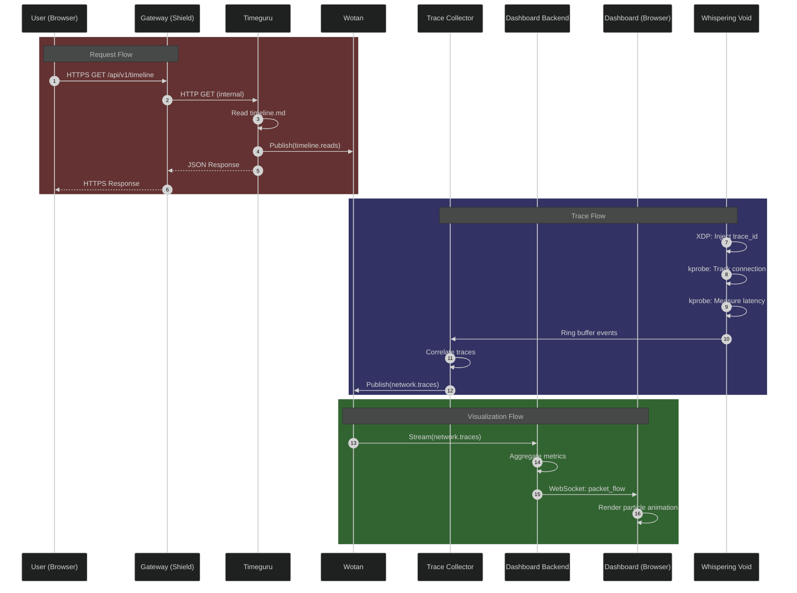

```mermaid
%%{init: {'theme': 'dark', 'themeVariables': { 'primaryColor': '#6366f1', 'primaryTextColor': '#fff', 'primaryBorderColor': '#818cf8', 'lineColor': '#94a3b8', 'secondaryColor': '#1e1b4b', 'tertiaryColor': '#0f172a'}}}%%
flowchart TB
    subgraph CROWN["THE CROWN - Matriarch & Patriarch"]
        direction LR
        USER["User<br/>The Sovereign"]
    end

    subgraph VISION["LAYER OF VISION & STRATEGY"]
        direction LR
        CAPTAIN["Captain<br/>Strategy & Vision<br/>10.10.10.21:8000"]
        TIMEGURU["Timeguru<br/>Timeline & Fate<br/>10.10.10.20:8000"]
    end

    subgraph EXECUTION["LAYER OF EXECUTION & ORDER"]
        direction LR
        MICROMANAGER["Micromanager<br/>Tasks & QA<br/>10.10.10.22:8000"]
        ARCHITECT["Architect<br/>Design & Patterns<br/>10.10.10.23:8000"]
    end

    subgraph COORDINATION["LAYER OF COORDINATION"]
        WOTAN["Wotan<br/>Message Broker<br/>10.10.10.10:8080/9090"]
    end

    subgraph OBSERVATION["LAYER OF OBSERVATION"]
        direction LR
        DASHBOARD["Dashboard Backend<br/>Metrics & WebSocket<br/>10.10.10.30:8082-83"]
        TRACE["Trace Collector<br/>eBPF Reader<br/>10.10.10.11:8081"]
    end

    subgraph VOID["THE WHISPERING VOID - eBPF Layer"]
        direction LR
        PACKET["packet_marker.bpf<br/>Trace ID Injection"]
        FLOW["flow_tracker.bpf<br/>Connection Tracking"]
        LATENCY["latency_probe.bpf<br/>RTT Measurement"]
    end

    subgraph FOUNDATION["THE FOUNDATION"]
        direction LR
        LXD["LXD Hypervisor<br/>lxdbr0: 10.10.10.0/24"]
        NIXOS["NixOS Containers<br/>Immutable & Declarative"]
    end

    subgraph BEDROCK["THE BEDROCK"]
        KERNEL["Linux Kernel 5.8+<br/>The Realm"]
    end

    CROWN --> VISION
    VISION --> EXECUTION
    EXECUTION --> COORDINATION
    COORDINATION --> OBSERVATION
    OBSERVATION --> VOID
    VOID --> FOUNDATION
    FOUNDATION --> BEDROCK

    style CROWN fill:#7c3aed,stroke:#a78bfa,stroke-width:3px
    style VISION fill:#4f46e5,stroke:#818cf8,stroke-width:2px
    style EXECUTION fill:#3730a3,stroke:#6366f1,stroke-width:2px
    style COORDINATION fill:#1e1b4b,stroke:#4f46e5,stroke-width:2px
    style OBSERVATION fill:#312e81,stroke:#4338ca,stroke-width:2px
    style VOID fill:#0f0a1a,stroke:#6b21a8,stroke-width:2px,stroke-dasharray: 5 5
    style FOUNDATION fill:#1e293b,stroke:#475569,stroke-width:2px
    style BEDROCK fill:#0f172a,stroke:#334155,stroke-width:2px
```

```mermaid
%%{init: {'theme': 'dark'}}%%
flowchart TB
    subgraph HELM["THE HELM - Gateway"]
        GW["nginx Gateway<br/>10.10.10.100<br/>:443 HTTPS/HTTP3<br/>:80 Redirect"]
    end

    subgraph BREASTPLATE["THE BREASTPLATE - Message Backbone"]
        WOTAN["Wotan<br/>10.10.10.10<br/>:8080 HTTP | :9090 gRPC"]

        subgraph TOPICS["Message Topics"]
            T1["network.traces"]
            T2["timeline.updates"]
            T3["strategy.decisions"]
            T4["tasks.assignments"]
            T5["design.proposals"]
            T6["alerts.critical"]
        end

        WOTAN --> TOPICS
    end

    subgraph GAUNTLETS["THE GAUNTLETS - Agent Services"]
        direction LR
        CAP["Captain<br/>.21:8000<br/>Strategy"]
        TIME["Timeguru<br/>.20:8000<br/>Timeline"]
        MICRO["Micromanager<br/>.22:8000<br/>Tasks & QA"]
        ARCH["Architect<br/>.23:8000<br/>Design"]
    end

    subgraph GREAVES["THE GREAVES - Observation Layer"]
        direction LR
        DASH["Dashboard Backend<br/>10.10.10.30<br/>:8082 HTTP | :8083 WS"]
        TRACE["Trace Collector<br/>10.10.10.11<br/>:8081 Metrics"]
    end

    subgraph SABATONS["THE SABATONS - eBPF (Whispering Void)"]
        direction LR
        PM["packet_marker.bpf<br/>XDP Trace Injection"]
        FT["flow_tracker.bpf<br/>Connection Tracking"]
        LP["latency_probe.bpf<br/>RTT Measurement"]
        RB[("Ring Buffer<br/>Kernel Space")]

        PM --> RB
        FT --> RB
        LP --> RB
    end

    subgraph SHIELD["THE SHIELD - User Zone"]
        DEMO["demo-app<br/>10.10.10.254<br/>ISOLATED"]
    end

    GW -->|TLS Term| BREASTPLATE
    GAUNTLETS <-->|Pub/Sub| WOTAN
    WOTAN <-->|Subscribe| GREAVES
    TRACE -->|Read| RB
    TRACE -->|Publish| WOTAN
    HELM -->|Route| GAUNTLETS
    HELM -->|Route| DASH
    HELM -.->|Only Access| SHIELD

    style HELM fill:#dc2626,stroke:#fca5a5,stroke-width:2px
    style BREASTPLATE fill:#7c2d12,stroke:#fb923c,stroke-width:2px
    style GAUNTLETS fill:#1e3a8a,stroke:#60a5fa,stroke-width:2px
    style GREAVES fill:#064e3b,stroke:#34d399,stroke-width:2px
    style SABATONS fill:#4c1d95,stroke:#a78bfa,stroke-width:2px
    style SHIELD fill:#1f2937,stroke:#9ca3af,stroke-width:2px,stroke-dasharray: 5 5
```

```mermaid
%%{init: {'theme': 'dark'}}%%
flowchart TB
    subgraph SURFACE["SURFACE LAYER - Visible Kingdom"]
        direction LR
        S1["Container<br/>Services"]
        S2["Container<br/>Services"]
        S3["Container<br/>Services"]
    end

    subgraph HOLLOWS["THE ARCANE HOLLOWS"]
        subgraph GROTTO["Crystal Grotto - Secrets"]
            SOPS["SOPS<br/>Encrypted Secrets"]
            AGE["AGE<br/>Key Management"]
            VAULT["Vault<br/>(Future)"]
            INJECT["Secret Injection<br/>at Startup"]

            SOPS <--> AGE
            AGE <--> VAULT
            SOPS --> INJECT
        end

        subgraph ABYSS["Mythic Abyss - Observability"]
            PROM["Prometheus<br/>Metrics Scraping<br/>:9100"]
            ZERO["Zerolog<br/>Structured Logging<br/>JSON stdout"]
            AGG["Metrics<br/>Aggregator"]
        end

        subgraph VOID["Whispering Void - eBPF"]
            VM["eBPF Virtual Machine<br/>(Kernel Space)"]

            subgraph HOOKS["Hooks"]
                XDP["XDP Hook<br/>packet_marker"]
                KP["kprobe Hook<br/>latency_probe"]
                TC["tc Hook<br/>flow_tracker"]
            end

            RING[("BPF Ring Buffer<br/>(per-CPU)")]
            RUST["trace-collector<br/>(Rust User Space)"]

            VM --> HOOKS
            XDP --> RING
            KP --> RING
            TC --> RING
            RING --> RUST
        end

        subgraph DEN["Daemon's Den - Control Plane"]
            DAEMON["unheaded-daemon<br/>(systemd service)"]
            ORCH["Container<br/>Orchestration"]
            BPF["eBPF Program<br/>Lifecycle"]
            STATE["State<br/>Enforcement"]
            HEALTH["Health<br/>Monitoring"]
            TEL["Telemetry<br/>to Wotan"]

            DAEMON --> ORCH
            DAEMON --> BPF
            DAEMON --> STATE
            DAEMON --> HEALTH
            DAEMON --> TEL
        end
    end

    subgraph DEEP["DEEP FOUNDATIONS"]
        LXD["LXD Container Runtime<br/>lxdbr0: 10.10.10.0/24"]
        ZFS["ZFS Storage Backend<br/>Snapshots & Compression"]
    end

    subgraph BEDROCK["THE BEDROCK"]
        KERNEL["Linux Kernel 5.8+<br/>eBPF VM | Netfilter | Namespaces | cgroups"]
    end

    SURFACE --> HOLLOWS
    GROTTO --> SURFACE
    ABYSS --> SURFACE
    RUST --> ABYSS
    DAEMON --> LXD
    HOLLOWS --> DEEP
    DEEP --> BEDROCK

    style GROTTO fill:#0d9488,stroke:#5eead4,stroke-width:2px
    style ABYSS fill:#7c2d12,stroke:#fdba74,stroke-width:2px
    style VOID fill:#4c1d95,stroke:#c4b5fd,stroke-width:2px
    style DEN fill:#1e3a8a,stroke:#93c5fd,stroke-width:2px
    style DEEP fill:#374151,stroke:#9ca3af,stroke-width:2px
    style BEDROCK fill:#111827,stroke:#6b7280,stroke-width:2px
```

```mermaid
%%{init: {'theme': 'dark'}}%%
flowchart TB
    subgraph EXTERNAL["EXTERNAL REALM"]
        BROWSER["User Browser"]
        INTERNET["Public Internet"]
    end

    subgraph DMZ["DEMILITARIZED ZONE"]
        GW["Gateway - nginx<br/>10.10.10.100<br/>:443 HTTPS/HTTP3 | :80 Redirect"]
    end

    subgraph MESH["INTERNAL MESH - lxdbr0: 10.10.10.0/24"]
        subgraph BFD["BFD Health Monitoring"]
            BFD_DESC["Interval: 300ms | Detect Mult: 3"]
        end

        subgraph CORE["Core Infrastructure"]
            WOTAN["Wotan<br/>10.10.10.10<br/>:8080 HTTP<br/>:9090 gRPC"]
            TRACE["Trace Collector<br/>10.10.10.11"]
        end

        subgraph AGENTS["Agent Services"]
            TIME["Timeguru<br/>10.10.10.20<br/>:8000"]
            CAP["Captain<br/>10.10.10.21<br/>:8000"]
            MICRO["Micromanager<br/>10.10.10.22<br/>:8000"]
            ARCH["Architect<br/>10.10.10.23<br/>:8000"]
        end

        subgraph APPS["Applications"]
            DASH["Dashboard Backend<br/>10.10.10.30<br/>:8082 HTTP<br/>:8083 WS"]
            KANBAN["Kanban App<br/>10.10.10.200<br/>:8001"]
        end

        subgraph ISOLATED["User Zone (Isolated)"]
            DEMO["demo-app<br/>10.10.10.254<br/>DENY ALL except GW"]
        end
    end

    subgraph FUTURE["VXLAN OVERLAY (Future)"]
        subgraph H1["Host 1 - Primary"]
            H1_NET["10.10.10.0/24<br/>ASN: 65001"]
        end
        subgraph H2["Host 2 - Replica"]
            H2_NET["10.10.20.0/24<br/>ASN: 65002"]
        end
        H1 <-->|VXLAN VNI:100| H2
    end

    BROWSER -->|HTTPS/HTTP3| GW
    INTERNET -->|HTTPS| GW

    GW -->|HTTP| KANBAN
    GW -->|HTTP| DASH
    GW -->|HTTP| AGENTS
    GW -.->|Only Path| DEMO

    AGENTS <-->|gRPC Pub/Sub| WOTAN
    DASH <-->|Subscribe| WOTAN
    TRACE -->|Publish| WOTAN
    KANBAN -->|REST| TIME

    style DMZ fill:#7f1d1d,stroke:#fca5a5,stroke-width:2px
    style MESH fill:#1e3a8a,stroke:#60a5fa,stroke-width:2px
    style ISOLATED fill:#374151,stroke:#f87171,stroke-width:2px,stroke-dasharray: 5 5
    style FUTURE fill:#0f172a,stroke:#6b7280,stroke-width:1px,stroke-dasharray: 3 3
```

```mermaid
%%{init: {'theme': 'dark', 'themeVariables': { 'primaryColor': '#7c3aed', 'edgeLabelBackground':'#1e1b4b'}}}%%
flowchart TB
    subgraph META["THE META MOMENT"]
        direction TB

        subgraph KINGDOM["Unheaded Kingdom (Production)"]
            subgraph INFRA["Infrastructure Layer"]
                DAEMON["unheaded-daemon"]
                LXD["LXD Hypervisor"]
                DAEMON --> LXD
            end

            subgraph TRACE["Observability Layer"]
                EBPF["eBPF Programs"]
                WOTAN["Wotan"]
                DASH["Dashboard"]
                EBPF --> WOTAN
                WOTAN --> DASH
            end

            subgraph APPS["Application Layer"]
                KANBAN["Kanban App"]
                TIME["Timeguru"]

                KANBAN -->|"GET /api/v1/timeline"| TIME
                TIME -->|"reads"| TIMELINE["timeline.md"]
            end
        end

        subgraph PROOF["The Recursive Proof"]
            P1["1. Infrastructure manages itself"]
            P2["2. Observability observes itself"]
            P3["3. Data describes its own creation"]
            P4["4. User witnesses the recursion"]

            P1 --> P2
            P2 --> P3
            P3 --> P4
        end

        subgraph RESULT["The Result"]
            BROWSER["User views Kanban<br/>showing tasks that<br/>built the system<br/>hosting the Kanban"]
        end
    end

    DAEMON -->|"orchestrates"| APPS
    EBPF -->|"traces"| APPS
    TIMELINE -->|"contains"| TASKS["Tasks: Build Kanban App"]
    KANBAN -->|"displays"| TASKS

    PROOF --> RESULT

    style META fill:#0f0a1a,stroke:#7c3aed,stroke-width:3px
    style KINGDOM fill:#1e1b4b,stroke:#6366f1,stroke-width:2px
    style PROOF fill:#312e81,stroke:#818cf8,stroke-width:2px
    style RESULT fill:#4c1d95,stroke:#a78bfa,stroke-width:2px
```

# The Unheaded Kingdom Architecture

```
                            +-----------------------------------------+
                            |    Self-hosting is proof.               |
                            |                                         |
                            |   A Visual Journey Through the Realms   |
                            +-----------------------------------------+
```

**Version:** Alpha | **Last Illuminated:** January 28, 2026

---

## Table of Contents

1. [The Sacred Hierarchy](#1-the-sacred-hierarchy)
2. [The Complete Knight](#2-the-complete-knight)
3. [The Arcane Hollows](#3-the-arcane-hollows)
4. [The Network Mesh](#4-the-network-mesh)
5. [Data Flow Diagrams](#5-data-flow-diagrams)
6. [The Meta Moment](#6-the-meta-moment)
7. [Legend & Nomenclature](#7-legend--nomenclature)

---

## 1. The Sacred Hierarchy

*From the Crown of Command to the Roots of Reality*

### ASCII Rendering

```
                           THE SACRED HIERARCHY
                      Of the Unheaded Kingdom

                                  .
                                 /|\
                                / | \
                               /  |  \
                              /   |   \
                             /    |    \
                            /     |     \
                           /      |      \
                          /   THE CROWN   \
                         /    (Matriarch   \
                        /     & Patriarch)  \
                       +--------+|+----------+
                                 ||
              ___________________||___________________
             |                   ||                   |
             |     LAYER OF VISION & STRATEGY        |
             |                                        |
             |   +----------+      +-----------+      |
             |   | CAPTAIN  |      | TIMEGURU  |      |
             |   | Strategy |      | Timeline  |      |
             |   | & Vision |      | & Fate    |      |
             |   +----+-----+      +-----+-----+      |
             |________|__________________|____________|
                      |                  |
              ________|__________________|________
             |                                    |
             |     LAYER OF EXECUTION & ORDER     |
             |                                    |
             |   +-------------+  +-----------+   |
             |   |MICROMANAGER |  | ARCHITECT |   |
             |   |   Tasks &   |  |  Design & |   |
             |   |     QA      |  |  Patterns |   |
             |   +------+------+  +-----+-----+   |
             |__________|_______________|_________|
                        |               |
              __________|_______________|__________
             |                                     |
             |     LAYER OF COORDINATION           |
             |                                     |
             |           +-----------+             |
             |           |  WOTAN   |             |
             |           | Message   |             |
             |           |   Broker  |             |
             |           +-----+-----+             |
             |_________________|___________________|
                               |
              _________________|___________________
             |                 |                   |
             |     LAYER OF OBSERVATION            |
             |                                     |
             |   +-------------+  +-----------+    |
             |   | DASHBOARD   |  |  TRACE    |    |
             |   |  BACKEND    |  | COLLECTOR |    |
             |   +------+------+  +-----+-----+    |
             |__________|_______________|__________|
                        |               |
              __________|_______________|__________
             |                                     |
             |     THE WHISPERING VOID (eBPF)      |
             |                                     |
             |   +-----------+  +-----------+      |
             |   | PACKET    |  |   FLOW    |      |
             |   | MARKER    |  |  TRACKER  |      |
             |   +-----------+  +-----------+      |
             |               +-----------+         |
             |               | LATENCY   |         |
             |               |  PROBE    |         |
             |               +-----------+         |
             |_____________________________________|
                               |
              _________________|___________________
             |                                     |
             |     THE FOUNDATION                  |
             |                                     |
             |   +-----------+   +-----------+     |
             |   |   LXD     |   |  NixOS    |     |
             |   | Hypervisor|   | Containers|     |
             |   +-----------+   +-----------+     |
             |                                     |
             |        THE REALM (Host OS)          |
             |_____________________________________|
                               |
              _________________|___________________
             |                                     |
             |     KERNEL (Linux 5.8+)             |
             |          The Bedrock                |
             |_____________________________________|
```

### Mermaid Rendering



---

## 2. The Complete Knight

*The Armor of the Kingdom - How All Pieces Connect*

### ASCII Rendering

```
                         THE COMPLETE KNIGHT
                    All Armor Pieces Connected

           +----------------------------------------------------------+
           |                                                          |
           |                    THE HELM (Gateway)                    |
           |                   nginx @ 10.10.10.100                   |
           |                                                          |
           |         +--------+    +--------+    +--------+           |
           |         | :443   |    | :80    |    | HTTP/3 |           |
           |         | HTTPS  |    |Redirect|    | QUIC   |           |
           |         +---+----+    +---+----+    +----+---+           |
           |             |             |              |                |
           +-------------|-------------|--------------|----------------+
                         |             |              |
                         +------+------+------+-------+
                                |
                                | TLS Termination
                                v
    +-------------------------------------------------------------------+
    |                                                                    |
    |                      THE BREASTPLATE                               |
    |                    (Service Mesh Core)                             |
    |                                                                    |
    |     +-----------------+                                            |
    |     |    WOTAN       |<============= Message Backbone             |
    |     | 10.10.10.10     |                                            |
    |     | :8080 HTTP      |   +--------+--------+--------+--------+   |
    |     | :9090 gRPC      |-->| Topic  | Topic  | Topic  | Topic  |   |
    |     +-----------------+   |network.|timeline|strategy|tasks.  |   |
    |            ^              |traces  |.updates|.decide |assign  |   |
    |            |              +--------+--------+--------+--------+   |
    +------------|--------------------------------------------------+
                 |
                 | Pub/Sub
                 |
    +-------------------------------------------------------------------+
    |                                                                    |
    |                       THE GAUNTLETS                                |
    |                    (Agent Services)                                |
    |                                                                    |
    |   +------------+  +------------+  +-------------+  +------------+  |
    |   | CAPTAIN    |  | TIMEGURU   |  | MICROMANAGER|  | ARCHITECT  |  |
    |   |.21:8000    |  |.20:8000    |  |.22:8000     |  |.23:8000    |  |
    |   |            |  |            |  |             |  |            |  |
    |   | Strategy   |  | Timeline   |  | Tasks       |  | Design     |  |
    |   | Decisions  |  | Tracking   |  | & QA        |  | Patterns   |  |
    |   +-----+------+  +-----+------+  +------+------+  +------+-----+  |
    |         |               |                |                |        |
    |         +-------+-------+-------+--------+----------------+        |
    |                 |                                                  |
    |                 v Publish to Wotan                                |
    +-------------------------------------------------------------------+
                                |
                                |
    +-------------------------------------------------------------------+
    |                                                                    |
    |                      THE GREAVES                                   |
    |                  (Observation Layer)                               |
    |                                                                    |
    |   +------------------+              +------------------+            |
    |   | DASHBOARD-BACKEND|              | TRACE-COLLECTOR  |           |
    |   | 10.10.10.30      |              | 10.10.10.11      |           |
    |   |                  |              |                  |           |
    |   | :8082 HTTP API   |<--Subscribe--|  Reads eBPF     |           |
    |   | :8083 WebSocket  |   Topics     |  Ring Buffer    |           |
    |   +--------+---------+              +--------+---------+           |
    |            |                                 |                     |
    |            | WebSocket                       | Publish             |
    |            | to Browser                      | network.traces      |
    +-------------------------------------------------------------------+
                 |                                 |
                 |                                 |
    +-------------------------------------------------------------------+
    |                                                                    |
    |                       THE SABATONS                                 |
    |                 (eBPF - The Whispering Void)                       |
    |                                                                    |
    |   +----------------+  +----------------+  +----------------+        |
    |   | packet_marker  |  | flow_tracker   |  | latency_probe  |       |
    |   |                |  |                |  |                |       |
    |   | XDP hook       |  | kprobe/tc      |  | kprobe         |       |
    |   | Inject trace   |  | Track conns    |  | Measure RTT    |       |
    |   +-------+--------+  +-------+--------+  +-------+--------+       |
    |           |                   |                   |                |
    |           +-------------------+-------------------+                |
    |                               |                                    |
    |                     +---------v----------+                         |
    |                     |    RING BUFFER     |                         |
    |                     | (Kernel Space)     |                         |
    |                     +--------------------+                         |
    +-------------------------------------------------------------------+
                                |
                                |
    +-------------------------------------------------------------------+
    |                                                                    |
    |                        THE SHIELD                                  |
    |               (User Zone - Isolated)                               |
    |                                                                    |
    |                   +------------------+                              |
    |                   |    DEMO-APP      |                              |
    |                   |  10.10.10.254    |                              |
    |                   |                  |                              |
    |                   |  DENY ALL except |                              |
    |                   |     gateway      |                              |
    |                   +------------------+                              |
    |                                                                    |
    |       "Zero Access to Kingdom Internals - Total Isolation"         |
    +-------------------------------------------------------------------+
```

### Mermaid Rendering



---

## 3. The Arcane Hollows

*The Hidden Infrastructure Layer - Beneath the Visible Kingdom*

### ASCII Rendering

```
                           THE ARCANE HOLLOWS
                    Hidden Infrastructure Map

    ========================================================================
    |                    THE SURFACE (Visible Kingdom)                      |
    ========================================================================
                |               |               |               |
                v               v               v               v
    +-----------+   +-----------+   +-----------+   +-----------+
    | Container |   | Container |   | Container |   | Container |
    |  Services |   |  Services |   |  Services |   |  Services |
    +-----------+   +-----------+   +-----------+   +-----------+
           |               |               |               |
    =======|===============|===============|===============|================
           |               |               |               |
           v               v               v               v
    +-----------------------------------------------------------------------+
    |                                                                        |
    |                    THE ARCANE HOLLOWS (Hidden Layer)                   |
    |                                                                        |
    |  +------------------------------------------------------------------+  |
    |  |                    THE CRYSTAL GROTTO                            |  |
    |  |                    (Secrets Management)                          |  |
    |  |                                                                  |  |
    |  |   +-------------+     +-------------+     +-------------+        |  |
    |  |   |    SOPS     |<--->|     AGE     |<--->|   VAULT     |        |  |
    |  |   | Encrypted   |     | Key Mgmt    |     |  (Future)   |        |  |
    |  |   |   Secrets   |     |             |     |             |        |  |
    |  |   +-------------+     +-------------+     +-------------+        |  |
    |  |          |                   |                   |               |  |
    |  |          +-------------------+-------------------+               |  |
    |  |                              |                                   |  |
    |  |                     +--------v--------+                          |  |
    |  |                     | Secret Injection|                          |  |
    |  |                     | at Container    |                          |  |
    |  |                     | Startup         |                          |  |
    |  |                     +-----------------+                          |  |
    |  +------------------------------------------------------------------+  |
    |                                                                        |
    |  +------------------------------------------------------------------+  |
    |  |                    THE MYTHIC ABYSS                              |  |
    |  |              (Observability Underworld)                          |  |
    |  |                                                                  |  |
    |  |   +-------------+     +-------------+     +-------------+        |  |
    |  |   | PROMETHEUS  |     | ZEROLOG     |     | METRICS     |        |  |
    |  |   | Metrics     |     | Structured  |     | Aggregator  |        |  |
    |  |   | Scraping    |     |   Logging   |     |             |        |  |
    |  |   +------+------+     +------+------+     +------+------+        |  |
    |  |          |                   |                   |               |  |
    |  |   +------v------+     +------v------+     +------v------+        |  |
    |  |   | :9100       |     | JSON        |     | Dashboard   |        |  |
    |  |   | Node Export |     | to Stdout   |     | Backend     |        |  |
    |  |   +-------------+     +-------------+     +-------------+        |  |
    |  +------------------------------------------------------------------+  |
    |                                                                        |
    |  +------------------------------------------------------------------+  |
    |  |                    THE WHISPERING VOID                           |  |
    |  |                   (eBPF Underworld)                              |  |
    |  |                                                                  |  |
    |  |            +---------------------------------------+             |  |
    |  |            |         eBPF VIRTUAL MACHINE          |             |  |
    |  |            |      (Sandboxed Kernel Space)         |             |  |
    |  |            +---------------------------------------+             |  |
    |  |                 |              |              |                  |  |
    |  |            +----v----+    +----v----+    +----v----+             |  |
    |  |            |   XDP   |    | kprobe  |    |   tc    |             |  |
    |  |            |  Hook   |    |  Hook   |    |  Hook   |             |  |
    |  |            +---------+    +---------+    +---------+             |  |
    |  |                 |              |              |                  |  |
    |  |            +----v--------------v--------------v----+             |  |
    |  |            |                                       |             |  |
    |  |            |     BPF RING BUFFER (per-CPU)        |             |  |
    |  |            |                                       |             |  |
    |  |            |  +-+-+-+-+-+-+-+-+-+-+-+-+-+-+-+-+   |             |  |
    |  |            |  | | | | | | | | | | | | | | | | |   |             |  |
    |  |            |  |T|R|A|C|E| |E|V|E|N|T|S| | | | |   |             |  |
    |  |            |  | | | | | | | | | | | | | | | | |   |             |  |
    |  |            |  +-+-+-+-+-+-+-+-+-+-+-+-+-+-+-+-+   |             |  |
    |  |            +-------------------+-------------------+             |  |
    |  |                                |                                 |  |
    |  |                        +-------v-------+                         |  |
    |  |                        |    RUST       |                         |  |
    |  |                        | trace-collect |                         |  |
    |  |                        | (User Space)  |                         |  |
    |  |                        +---------------+                         |  |
    |  +------------------------------------------------------------------+  |
    |                                                                        |
    |  +------------------------------------------------------------------+  |
    |  |                    THE DAEMON'S DEN                              |  |
    |  |              (Control Plane Headquarters)                        |  |
    |  |                                                                  |  |
    |  |   +-----------------------------------------------------------+  |  |
    |  |   |              UNHEADED-DAEMON (systemd)                    |  |  |
    |  |   |                                                           |  |  |
    |  |   |  +----------------+  +----------------+  +-------------+  |  |  |
    |  |   |  | Container      |  | eBPF Program   |  | State       |  |  |  |
    |  |   |  | Orchestration  |  | Lifecycle      |  | Enforcement |  |  |  |
    |  |   |  | (LXD API)      |  | (bpftool)      |  | (Drift Det) |  |  |  |
    |  |   |  +----------------+  +----------------+  +-------------+  |  |  |
    |  |   |                                                           |  |  |
    |  |   |  +----------------+  +----------------+  +-------------+  |  |  |
    |  |   |  | Health         |  | Telemetry      |  | Config      |  |  |  |
    |  |   |  | Monitoring     |  | to Wotan      |  | Management  |  |  |  |
    |  |   |  +----------------+  +----------------+  +-------------+  |  |  |
    |  |   +-----------------------------------------------------------+  |  |
    |  +------------------------------------------------------------------+  |
    |                                                                        |
    +------------------------------------------------------------------------+
                                       |
                                       v
    +------------------------------------------------------------------------+
    |                                                                        |
    |                        THE DEEP FOUNDATIONS                            |
    |                                                                        |
    |   +------------------------+          +---------------------------+    |
    |   |        LXD             |          |         ZFS               |    |
    |   |  Container Runtime     |          |    Storage Backend        |    |
    |   |                        |          |                           |    |
    |   |  lxdbr0: 10.10.10.0/24 |          |  Snapshots, Compression   |    |
    |   +------------------------+          +---------------------------+    |
    |                                                                        |
    +------------------------------------------------------------------------+
                                       |
                                       v
    +------------------------------------------------------------------------+
    |                           THE BEDROCK                                  |
    |                                                                        |
    |   +---------------------------------------------------------------+   |
    |   |                    LINUX KERNEL 5.8+                          |   |
    |   |                                                               |   |
    |   |   eBPF VM | Netfilter | Namespaces | cgroups | Capabilities   |   |
    |   +---------------------------------------------------------------+   |
    +------------------------------------------------------------------------+
```

### Mermaid Rendering



---

## 4. The Network Mesh

*BGP, BFD, VXLAN Connections Between Kingdom Components*

### ASCII Rendering

```
                           THE NETWORK MESH
                 BGP/BFD/VXLAN Topology of the Kingdom

    ============================================================================
    |                        EXTERNAL REALM                                    |
    |                                                                          |
    |    +------------------+         +------------------+                     |
    |    |   User Browser   |         |  Public Internet |                     |
    |    +--------+---------+         +--------+---------+                     |
    |             |                            |                                |
    |             | HTTPS/HTTP3 (QUIC)        |                                |
    |             | TLS 1.3                    |                                |
    |             |                            |                                |
    ============================================================================
                  |                            |
                  +------------+---------------+
                               |
                               | Port 443/TCP, 443/UDP
                               v
    ============================================================================
    |                    DEMILITARIZED ZONE (DMZ)                              |
    |                                                                          |
    |         +----------------------------------------------------+           |
    |         |                  GATEWAY                           |           |
    |         |               10.10.10.100                         |           |
    |         |                                                    |           |
    |         |  +---------------+  +---------------+              |           |
    |         |  | :443 HTTPS    |  | :80 HTTP      |              |           |
    |         |  | HTTP/3 + QUIC |  | (redirect)    |              |           |
    |         |  +-------+-------+  +-------+-------+              |           |
    |         |          |                  |                      |           |
    |         |          +--------+---------+                      |           |
    |         |                   |                                |           |
    |         |  ROUTING TABLE:   |                                |           |
    |         |  /           --> Dashboard Backend (.30)           |           |
    |         |  /kanban     --> Kanban App (.200)                 |           |
    |         |  /api/*      --> Agent Services (.20-.23)          |           |
    |         |  /ws         --> Dashboard WebSocket (.30)         |           |
    |         |  /grpc       --> Wotan gRPC-Web (.10)             |           |
    |         +----------------------------------------------------+           |
    |                                  |                                       |
    ============================================================================
                                       |
                                       | Internal HTTP/gRPC
                                       |
    ============================================================================
    |                    INTERNAL MESH (lxdbr0: 10.10.10.0/24)                 |
    |                                                                          |
    |         +--------------------------------------------------------+       |
    |         |                                                        |       |
    |         |      BFD (Bidirectional Forwarding Detection)          |       |
    |         |          Health Monitoring Between Services            |       |
    |         |                                                        |       |
    |         |   Interval: 300ms  |  Detect Mult: 3  |  Echo: On     |       |
    |         +--------------------------------------------------------+       |
    |                                                                          |
    |   +--------+     +--------+     +--------+     +--------+     +--------+ |
    |   |WOTAN  |<===>|TIMEGURU|<===>|CAPTAIN |<===>|MICRO-  |<===>|ARCHITECT||
    |   |.10     |     |.20     |     |.21     |     |MANAGER |     |.23     | |
    |   |        |     |        |     |        |     |.22     |     |        | |
    |   +---+----+     +---+----+     +---+----+     +---+----+     +---+----+ |
    |       |              |              |              |              |      |
    |       +--------------+--------------+--------------+--------------+      |
    |                                     |                                    |
    |                           +---------v---------+                          |
    |                           |    MESH FABRIC    |                          |
    |                           |                   |                          |
    |                           | Protocol: gRPC    |                          |
    |                           | Pub/Sub via       |                          |
    |                           | Wotan Topics     |                          |
    |                           |                   |                          |
    |                           | Latency: <5ms     |                          |
    |                           +-------------------+                          |
    |                                                                          |
    |   +----------------------------------------------------------------------+
    |   |                                                                      |
    |   |                    CONNECTION MATRIX                                 |
    |   |                                                                      |
    |   |    FROM/TO    | WOTAN | GATEWAY | SERVICES | DASHBOARD | DEMO-APP  |
    |   |    ---------- | ------ | ------- | -------- | --------- | --------  |
    |   |    WOTAN     |   -    |   N     |    Y     |     Y     |    N      |
    |   |    GATEWAY    |   Y    |   -     |    Y     |     Y     |    Y      |
    |   |    SERVICES   |   Y    |   N     |    Y     |     N     |    N      |
    |   |    DASHBOARD  |   Y    |   N     |    N     |     -     |    N      |
    |   |    DEMO-APP   |   N    |   Y*    |    N     |     N     |    -      |
    |   |                                                                      |
    |   |    * = Only via Gateway (isolated)                                   |
    |   +----------------------------------------------------------------------+
    |                                                                          |
    ============================================================================
                                       |
                                       |
    ============================================================================
    |                    VXLAN OVERLAY (Future Multi-Host)                     |
    |                                                                          |
    |     +------------------+           +------------------+                   |
    |     |     HOST 1       |  VXLAN    |     HOST 2       |                   |
    |     | (Primary)        |<==========| (Replica)        |                   |
    |     |                  |  VNI:100  |                  |                   |
    |     | 10.10.10.0/24    |           | 10.10.20.0/24    |                   |
    |     +------------------+           +------------------+                   |
    |                                                                          |
    |     BGP EVPN (Future):                                                   |
    |     - ASN: 65001 (Host 1), 65002 (Host 2)                               |
    |     - Route Reflector: Wotan (primary)                                  |
    |     - VTEP: Each host's bridge interface                                |
    |                                                                          |
    ============================================================================

                           NETWORK FLOW DIAGRAM

          +------------+                               +------------+
          | EXTERNAL   |                               | EXTERNAL   |
          | (Browser)  |                               | (API)      |
          +-----+------+                               +-----+------+
                |                                            |
                | HTTPS :443                                 | HTTPS :443
                v                                            v
          +-----+------+                               +-----+------+
          | GATEWAY    |                               | GATEWAY    |
          | nginx      |                               | nginx      |
          +-----+------+                               +-----+------+
                |                                            |
                | HTTP :8001                                 | HTTP :8000
                v                                            v
          +-----+------+                               +-----+------+
          | KANBAN-APP |                               | TIMEGURU   |
          | Static +   |------- HTTP :8000 ------>     | REST API   |
          | API proxy  |                               |            |
          +-----+------+                               +-----+------+
                                                             |
                                                             | gRPC :9090
                                                             v
                                                       +-----+------+
                                                       | WOTAN     |
                                                       | Pub/Sub    |
                                                       +-----+------+
                                                             |
                                                             | gRPC Stream
                                                             v
                                                       +-----+------+
                                                       | DASHBOARD- |
                                                       | BACKEND    |
                                                       +-----+------+
                                                             |
                                                             | WebSocket :8083
                                                             v
                                                       +-----+------+
                                                       | DASHBOARD  |
                                                       | (Browser)  |
                                                       +------------+
```

### Mermaid Rendering



---

## 5. Data Flow Diagrams

### 5.1 Request Flow: User Through Shield to Services to Wotan

#### ASCII Rendering

```
                     REQUEST FLOW THROUGH THE KINGDOM
              From Sovereign (User) to the Message Realm

    +----------+
    |   USER   |  The Sovereign makes a request
    | (Browser)|
    +----+-----+
         |
         | 1. HTTPS Request (TLS 1.3 / HTTP/3 QUIC)
         |    GET https://kingdom.io/api/v1/timeline
         v
    +----+-----+------------------------------------------------------+
    |         THE SHIELD (Gateway - nginx)                            |
    |         10.10.10.100:443                                        |
    |                                                                 |
    |   +----------------------------------------------------------+  |
    |   |  TLS Termination                                         |  |
    |   |  - Certificate validation                                |  |
    |   |  - Session resumption (0-RTT when possible)              |  |
    |   |  - HTTP/3 multiplexing                                   |  |
    |   +----------------------------------------------------------+  |
    |                              |                                  |
    |   +----------------------------------------------------------+  |
    |   |  Route Matching                                          |  |
    |   |  /api/v1/timeline --> timeguru (10.10.10.20:8000)       |  |
    |   +----------------------------------------------------------+  |
    |                              |                                  |
    |   +----------------------------------------------------------+  |
    |   |  Security Headers Injection                              |  |
    |   |  X-Request-ID: abc123                                    |  |
    |   |  X-Forwarded-For: <client-ip>                            |  |
    |   +----------------------------------------------------------+  |
    +------------------------------|----------------------------------+
                                   |
         2. Internal HTTP          | (Request enters the Kingdom)
            (Plain HTTP OK         |
             within mesh)          |
                                   v
    +------------------------------+----------------------------------+
    |              TIMEGURU SERVICE                                   |
    |              10.10.10.20:8000                                   |
    |                                                                 |
    |   +----------------------------------------------------------+  |
    |   |  Request Handler: GET /api/v1/timeline                   |  |
    |   |  - Validate request                                      |  |
    |   |  - Extract query params (since, limit)                   |  |
    |   +----------------------------------------------------------+  |
    |                              |                                  |
    |   +----------------------------------------------------------+  |
    |   |  Read Source of Truth                                    |  |
    |   |  File: /opt/unheaded/references/timeline.md              |  |
    |   |  Parse: Markdown --> JSON                                |  |
    |   +----------------------------------------------------------+  |
    |                              |                                  |
    |   +----------------------------------------------------------+  |
    |   |  Publish Event to Wotan                                 |  |
    |   |  Topic: timeline.reads                                   |  |
    |   |  Payload: { reader: "web", timestamp: "..." }            |  |
    |   +----------------------------------------------------------+  |
    +------------------------------|----------------------------------+
                                   |
         3. gRPC Streaming         | (Event published to Message Bus)
            Port 9090              |
                                   v
    +------------------------------+----------------------------------+
    |              WOTAN MESSAGE BUS                                 |
    |              10.10.10.10:9090                                   |
    |                                                                 |
    |   +----------------------------------------------------------+  |
    |   |  Topic: timeline.reads                                   |  |
    |   |                                                          |  |
    |   |  +----------------------------------------------------+  |  |
    |   |  |  RING BUFFER                                       |  |  |
    |   |  |  +-+-+-+-+-+-+-+-+-+-+-+-+-+-+-+-+-+-+-+-+-+-+-+   |  |  |
    |   |  |  |M|M|M|M|M|M|M|M|M|M|M|M|M|M|M|M|M|M|M|M|M|M| |   |  |  |
    |   |  |  |1|2|3|4|5|6|7|8|9|.|.|.|.|.|.|.|.|.|.|.|.|N|<+NEW |  |  |
    |   |  |  +-+-+-+-+-+-+-+-+-+-+-+-+-+-+-+-+-+-+-+-+-+-+-+   |  |  |
    |   |  +----------------------------------------------------+  |  |
    |   +----------------------------------------------------------+  |
    |                              |                                  |
    |   +----------------------------------------------------------+  |
    |   |  Fanout to Subscribers                                   |  |
    |   |  - dashboard-backend (active)                            |  |
    |   |  - metrics-collector (active)                            |  |
    |   +----------------------------------------------------------+  |
    +------------------------------|----------------------------------+
                                   |
         4. gRPC Stream            | (Event delivered to subscribers)
            (Non-blocking fanout)  |
                                   v
    +------------------------------+----------------------------------+
    |              DASHBOARD BACKEND                                  |
    |              10.10.10.30:8082                                   |
    |                                                                 |
    |   +----------------------------------------------------------+  |
    |   |  Stream Handler                                          |  |
    |   |  - Receive event from Wotan                             |  |
    |   |  - Aggregate metrics                                     |  |
    |   |  - Update in-memory state                                |  |
    |   +----------------------------------------------------------+  |
    |                              |                                  |
    |   +----------------------------------------------------------+  |
    |   |  WebSocket Broadcast                                     |  |
    |   |  Push to all connected dashboard clients                 |  |
    |   +----------------------------------------------------------+  |
    +------------------------------|----------------------------------+
                                   |
         5. WebSocket              | (Real-time update to browser)
            Port 8083              |
                                   v
    +------------------------------+----------------------------------+
    |              DASHBOARD (Browser)                                |
    |                                                                 |
    |   +----------------------------------------------------------+  |
    |   |  WebSocket Message Received                              |  |
    |   |  { type: "timeline.read", data: {...} }                  |  |
    |   +----------------------------------------------------------+  |
    |                              |                                  |
    |   +----------------------------------------------------------+  |
    |   |  UI Update                                               |  |
    |   |  - Flash "Timeline accessed" indicator                   |  |
    |   |  - Update activity log                                   |  |
    |   |  - Render new metrics                                    |  |
    |   +----------------------------------------------------------+  |
    +------------------------------------------------------------------+

                        RESPONSE FLOW (Reverse)

    +------------------------------------------------------------------+
    |   TIMEGURU returns JSON to GATEWAY                               |
    |   HTTP 200 OK                                                    |
    |   Content-Type: application/json                                 |
    |   { "phases": [...], "milestones": [...] }                       |
    +------------------------------------------------------------------+
                                   |
                                   v
    +------------------------------------------------------------------+
    |   GATEWAY returns to USER                                        |
    |   HTTPS 200 OK                                                   |
    |   (TLS encrypted, possibly 0-RTT)                                |
    |   Total latency: ~47ms                                           |
    +------------------------------------------------------------------+
```

### 5.2 Trace Flow: Whispering Void Through Mythic Abyss to Dashboard

#### ASCII Rendering

```
                         TRACE FLOW THROUGH THE KINGDOM
                 From Whispering Void to Mythic Abyss to Dashboard

    +--------------------------------------------------------------------------+
    |                    PACKET ARRIVES AT NETWORK INTERFACE                    |
    |                              (eth0 on host)                               |
    +--------------------------------------------------------------------------+
                                       |
                                       v
    +--------------------------------------------------------------------------+
    |                         THE WHISPERING VOID                               |
    |                           (eBPF Layer)                                    |
    |                                                                           |
    |   1. XDP Hook (packet_marker.bpf)                                        |
    |      +----------------------------------------------------------+        |
    |      |  Execution Point: XDP_PASS (earliest possible)           |        |
    |      |                                                          |        |
    |      |  Action:                                                 |        |
    |      |  - Generate trace_id (64-bit random)                     |        |
    |      |  - Inject into packet metadata                           |        |
    |      |  - Record: timestamp, src_ip, dst_ip, dst_port           |        |
    |      |                                                          |        |
    |      |  Output Event:                                           |        |
    |      |  {                                                       |        |
    |      |    trace_id: 0xabc123def456,                             |        |
    |      |    event_type: PACKET_IN,                                |        |
    |      |    timestamp_ns: 1706400000000000000,                    |        |
    |      |    src_addr: 203.0.113.50,                               |        |
    |      |    dst_addr: 10.10.10.100,                               |        |
    |      |    dst_port: 443,                                        |        |
    |      |    protocol: TCP,                                        |        |
    |      |    len: 1500                                             |        |
    |      |  }                                                       |        |
    |      +----------------------------------------------------------+        |
    |                              |                                           |
    |   2. kprobe Hook (flow_tracker.bpf)                                      |
    |      +----------------------------------------------------------+        |
    |      |  Execution Point: tcp_connect, tcp_accept                |        |
    |      |                                                          |        |
    |      |  Action:                                                 |        |
    |      |  - Track connection state (SYN, ESTABLISHED, FIN)        |        |
    |      |  - Correlate with trace_id from XDP                      |        |
    |      |  - Record: connection tuple, state transitions           |        |
    |      |                                                          |        |
    |      |  Output Event:                                           |        |
    |      |  {                                                       |        |
    |      |    trace_id: 0xabc123def456,                             |        |
    |      |    event_type: CONN_ESTABLISHED,                         |        |
    |      |    src_addr: 203.0.113.50:52431,                         |        |
    |      |    dst_addr: 10.10.10.100:443,                           |        |
    |      |    conn_id: 0x789,                                       |        |
    |      |    timestamp_ns: 1706400000000100000                     |        |
    |      |  }                                                       |        |
    |      +----------------------------------------------------------+        |
    |                              |                                           |
    |   3. kprobe Hook (latency_probe.bpf)                                     |
    |      +----------------------------------------------------------+        |
    |      |  Execution Point: tcp_rcv_established, tcp_sendmsg       |        |
    |      |                                                          |        |
    |      |  Action:                                                 |        |
    |      |  - Calculate RTT from ACK timing                         |        |
    |      |  - Track time-in-kernel per packet                       |        |
    |      |                                                          |        |
    |      |  Output Event:                                           |        |
    |      |  {                                                       |        |
    |      |    trace_id: 0xabc123def456,                             |        |
    |      |    event_type: LATENCY_SAMPLE,                           |        |
    |      |    conn_id: 0x789,                                       |        |
    |      |    rtt_us: 2340,                                         |        |
    |      |    kernel_time_ns: 45000                                 |        |
    |      |  }                                                       |        |
    |      +----------------------------------------------------------+        |
    |                              |                                           |
    |   4. BPF Ring Buffer                                                     |
    |      +----------------------------------------------------------+        |
    |      |  Per-CPU ring buffers collecting all events              |        |
    |      |                                                          |        |
    |      |  CPU0: [E1][E2][E3][E4][E5][  ][  ][  ]                  |        |
    |      |  CPU1: [E1][E2][  ][  ][  ][  ][  ][  ]                  |        |
    |      |  CPU2: [E1][E2][E3][E4][E5][E6][E7][  ]                  |        |
    |      |  CPU3: [E1][  ][  ][  ][  ][  ][  ][  ]                  |        |
    |      +----------------------------------------------------------+        |
    +--------------------------------------------------------------------------+
                                       |
                                       | Poll every 100ms (or epoll notification)
                                       v
    +--------------------------------------------------------------------------+
    |                         TRACE COLLECTOR (Rust)                            |
    |                           10.10.10.11:8081                                |
    |                                                                           |
    |   +------------------------------------------------------------------+   |
    |   |  Ring Buffer Reader (libbpf-rs)                                  |   |
    |   |                                                                  |   |
    |   |  loop {                                                          |   |
    |   |      events = ring_buffer.poll(100ms);                           |   |
    |   |      for event in events {                                       |   |
    |   |          let trace = deserialize(event);                         |   |
    |   |          correlator.add(trace);                                  |   |
    |   |      }                                                           |   |
    |   |  }                                                               |   |
    |   +------------------------------------------------------------------+   |
    |                              |                                           |
    |   +------------------------------------------------------------------+   |
    |   |  Trace Correlator                                                |   |
    |   |                                                                  |   |
    |   |  - Group events by trace_id                                      |   |
    |   |  - Order by timestamp                                            |   |
    |   |  - Compute derived metrics (total latency, hop count)            |   |
    |   |  - Build complete trace object                                   |   |
    |   |                                                                  |   |
    |   |  CorrelatedTrace {                                               |   |
    |   |    trace_id: 0xabc123def456,                                     |   |
    |   |    start_time: 1706400000000000000,                              |   |
    |   |    end_time: 1706400000047000000,                                |   |
    |   |    duration_ms: 47,                                              |   |
    |   |    hops: [                                                       |   |
    |   |      { from: "external", to: "gateway", latency_us: 2340 },      |   |
    |   |      { from: "gateway", to: "timeguru", latency_us: 1200 },      |   |
    |   |      { from: "timeguru", to: "gateway", latency_us: 800 },       |   |
    |   |      { from: "gateway", to: "external", latency_us: 500 }        |   |
    |   |    ],                                                            |   |
    |   |    status: SUCCESS                                               |   |
    |   |  }                                                               |   |
    |   +------------------------------------------------------------------+   |
    |                              |                                           |
    |   +------------------------------------------------------------------+   |
    |   |  Wotan Publisher (gRPC)                                         |   |
    |   |                                                                  |   |
    |   |  client.publish(Topic::NetworkTraces, &correlated_trace)?;       |   |
    |   +------------------------------------------------------------------+   |
    +--------------------------------------------------------------------------+
                                       |
                                       | gRPC :9090
                                       v
    +--------------------------------------------------------------------------+
    |                         THE MYTHIC ABYSS                                  |
    |                     (Wotan - Observability Hub)                          |
    |                                                                           |
    |   +------------------------------------------------------------------+   |
    |   |  Topic: network.traces                                           |   |
    |   |                                                                  |   |
    |   |  Ring Buffer (1000 messages, ~100KB)                             |   |
    |   |  Subscribers:                                                    |   |
    |   |    - dashboard-backend (streaming)                               |   |
    |   |    - alerting-service (batch, future)                            |   |
    |   +------------------------------------------------------------------+   |
    |                              |                                           |
    |   +------------------------------------------------------------------+   |
    |   |  Fanout Engine                                                   |   |
    |   |                                                                  |   |
    |   |  for subscriber in topic.subscribers {                           |   |
    |   |      subscriber.channel.send(event)?; // Non-blocking            |   |
    |   |  }                                                               |   |
    |   +------------------------------------------------------------------+   |
    +--------------------------------------------------------------------------+
                                       |
                                       | gRPC Stream
                                       v
    +--------------------------------------------------------------------------+
    |                       DASHBOARD BACKEND                                   |
    |                        10.10.10.30:8082                                   |
    |                                                                           |
    |   +------------------------------------------------------------------+   |
    |   |  Metrics Aggregator                                              |   |
    |   |                                                                  |   |
    |   |  - Rolling window (last 60 seconds)                              |   |
    |   |  - Compute: avg_latency, p99_latency, throughput                 |   |
    |   |  - Track: trace count, error rate, hot paths                     |   |
    |   +------------------------------------------------------------------+   |
    |                              |                                           |
    |   +------------------------------------------------------------------+   |
    |   |  Packet Flow Generator                                           |   |
    |   |                                                                  |   |
    |   |  - Convert traces to visual packets                              |   |
    |   |  - Assign colors by latency (green < 50ms, yellow, red > 200ms)  |   |
    |   |  - Queue for WebSocket broadcast                                 |   |
    |   +------------------------------------------------------------------+   |
    |                              |                                           |
    |   +------------------------------------------------------------------+   |
    |   |  WebSocket Server (:8083)                                        |   |
    |   |                                                                  |   |
    |   |  Broadcast to all connected clients:                             |   |
    |   |  {                                                               |   |
    |   |    type: "packet_flow",                                          |   |
    |   |    data: {                                                       |   |
    |   |      trace_id: "abc123def456",                                   |   |
    |   |      path: ["external", "gateway", "timeguru", "gateway"],       |   |
    |   |      latency_ms: 47,                                             |   |
    |   |      color: "#22c55e"                                            |   |
    |   |    }                                                             |   |
    |   |  }                                                               |   |
    |   +------------------------------------------------------------------+   |
    +--------------------------------------------------------------------------+
                                       |
                                       | WebSocket
                                       v
    +--------------------------------------------------------------------------+
    |                       DASHBOARD (Browser)                                 |
    |                                                                           |
    |   +------------------------------------------------------------------+   |
    |   |  Particle Canvas Renderer                                        |   |
    |   |                                                                  |   |
    |   |  - Spawn particle at "external" node position                    |   |
    |   |  - Animate along path: gateway -> timeguru -> gateway            |   |
    |   |  - Apply glow effect based on latency                            |   |
    |   |  - Fade out at destination                                       |   |
    |   +------------------------------------------------------------------+   |
    |                                                                          |
    |   Visual Result:                                                         |
    |                                                                          |
    |   +------------------------------------------------------------------+   |
    |   |                                                                  |   |
    |   |     [EXTERNAL]                                                   |   |
    |   |          |                                                       |   |
    |   |          *  <-- Green particle (fast trace)                      |   |
    |   |          |                                                       |   |
    |   |     [GATEWAY]                                                    |   |
    |   |        / \                                                       |   |
    |   |       *   |                                                      |   |
    |   |      /    |                                                      |   |
    |   | [TIMEGURU]  [KANBAN]                                             |   |
    |   |                                                                  |   |
    |   |  Metrics Panel:                                                  |   |
    |   |  +-----------------------+                                       |   |
    |   |  | Avg Latency:   47ms   |                                       |   |
    |   |  | P99 Latency:  124ms   |                                       |   |
    |   |  | Throughput:  1.2k/s   |                                       |   |
    |   |  | Error Rate:   0.01%   |                                       |   |
    |   |  +-----------------------+                                       |   |
    |   |                                                                  |   |
    |   +------------------------------------------------------------------+   |
    +--------------------------------------------------------------------------+
```

### 5.3 Secret Flow Through Crystal Grotto

#### ASCII Rendering

```
                         SECRET FLOW THROUGH CRYSTAL GROTTO
                    From Encrypted Rest to Runtime Illumination

    +--------------------------------------------------------------------------+
    |                    GIT REPOSITORY (Source of Truth)                       |
    |                                                                           |
    |   secrets/                                                               |
    |   +-- .sops.yaml                    (SOPS configuration)                 |
    |   +-- production/                                                        |
    |   |   +-- wotan.enc.yaml           (Encrypted: TLS certs, API keys)     |
    |   |   +-- services.enc.yaml         (Encrypted: Service tokens)          |
    |   +-- development/                                                       |
    |       +-- wotan.enc.yaml           (Encrypted: Dev secrets)             |
    |                                                                           |
    +--------------------------------------------------------------------------+
                                       |
                                       | 1. nix-build / deployment trigger
                                       v
    +--------------------------------------------------------------------------+
    |                    THE CRYSTAL GROTTO (Secrets Layer)                     |
    |                                                                           |
    |   +------------------------------------------------------------------+   |
    |   |  SOPS (Secrets OPerationS)                                       |   |
    |   |                                                                  |   |
    |   |  .sops.yaml:                                                     |   |
    |   |  creation_rules:                                                 |   |
    |   |    - path_regex: secrets/production/.*                           |   |
    |   |      key_groups:                                                 |   |
    |   |        - age:                                                    |   |
    |   |          - age1ql3z7hjy54pw3hyww5...  # Production key           |   |
    |   |        - age:                                                    |   |
    |   |          - age1abc123...              # Backup key               |   |
    |   +------------------------------------------------------------------+   |
    |                              |                                           |
    |   +------------------------------------------------------------------+   |
    |   |  AGE Encryption (Modern, Simple)                                 |   |
    |   |                                                                  |   |
    |   |  Key Location:                                                   |   |
    |   |    - Host: /var/lib/unheaded/age/keys.txt                        |   |
    |   |    - Protected: chmod 400, root:root                             |   |
    |   |                                                                  |   |
    |   |  Key Format:                                                     |   |
    |   |    AGE-SECRET-KEY-1QLZJ7QPACLSW...                               |   |
    |   +------------------------------------------------------------------+   |
    |                              |                                           |
    |   2. Decryption at Container Build/Start                                 |
    |                              |                                           |
    |   +------------------------------------------------------------------+   |
    |   |  unheaded-daemon (Secret Injection)                              |   |
    |   |                                                                  |   |
    |   |  fn inject_secrets(container: &Container) -> Result<()> {        |   |
    |   |      let encrypted = read_sops_file(container.secrets_path)?;    |   |
    |   |      let decrypted = sops_decrypt(&encrypted, &age_key)?;        |   |
    |   |                                                                  |   |
    |   |      // Inject as environment variables (ephemeral)              |   |
    |   |      for (key, value) in decrypted.iter() {                      |   |
    |   |          container.set_env(key, value);                          |   |
    |   |      }                                                           |   |
    |   |                                                                  |   |
    |   |      // Or mount as tmpfs volume (never touches disk)            |   |
    |   |      container.mount_secret_volume("/run/secrets", &decrypted);  |   |
    |   |  }                                                               |   |
    |   +------------------------------------------------------------------+   |
    +--------------------------------------------------------------------------+
                                       |
                                       | 3. Runtime (Secrets in Memory Only)
                                       v
    +--------------------------------------------------------------------------+
    |                    CONTAINER RUNTIME                                      |
    |                                                                           |
    |   +------------------------------------------------------------------+   |
    |   |  WOTAN Container (10.10.10.10)                                  |   |
    |   |                                                                  |   |
    |   |  Environment:                                                    |   |
    |   |    WOTAN_TLS_CERT=/run/secrets/tls.crt                          |   |
    |   |    WOTAN_TLS_KEY=/run/secrets/tls.key                           |   |
    |   |    WOTAN_ADMIN_TOKEN=<injected at runtime>                      |   |
    |   |                                                                  |   |
    |   |  /run/secrets/ (tmpfs - RAM only, never on disk):                |   |
    |   |    +-- tls.crt           (Decrypted TLS certificate)             |   |
    |   |    +-- tls.key           (Decrypted private key)                 |   |
    |   |    +-- admin-token.txt   (Decrypted admin token)                 |   |
    |   |                                                                  |   |
    |   |  Process Memory:                                                 |   |
    |   |    Secrets loaded, encrypted file never written                  |   |
    |   +------------------------------------------------------------------+   |
    |                                                                          |
    |   +------------------------------------------------------------------+   |
    |   |  TIMEGURU Container (10.10.10.20)                                |   |
    |   |                                                                  |   |
    |   |  /run/secrets/:                                                  |   |
    |   |    +-- wotan-client-token.txt  (For Wotan auth)                |   |
    |   |    +-- api-signing-key.txt      (For response signing)           |   |
    |   +------------------------------------------------------------------+   |
    |                                                                          |
    |   [Similar for: captain, micromanager, architect, dashboard-backend]     |
    +--------------------------------------------------------------------------+
                                       |
                                       | 4. Secret Rotation (Future)
                                       v
    +--------------------------------------------------------------------------+
    |                    SECRET ROTATION FLOW (Future)                          |
    |                                                                           |
    |   +------------------------------------------------------------------+   |
    |   |  Automated Rotation (via Wotan coordination)                    |   |
    |   |                                                                  |   |
    |   |  1. Generate new secret                                          |   |
    |   |  2. Encrypt with SOPS/AGE                                        |   |
    |   |  3. Commit to Git (triggers CI/CD)                               |   |
    |   |  4. Rolling container restart                                    |   |
    |   |  5. Old containers drain, new containers start with new secrets  |   |
    |   |  6. Zero-downtime rotation complete                              |   |
    |   +------------------------------------------------------------------+   |
    +--------------------------------------------------------------------------+

                           SECURITY PROPERTIES

    +--------------------------------------------------------------------------+
    |                                                                          |
    |  AT REST:                                                               |
    |    - All secrets encrypted with AGE (X25519 + ChaCha20-Poly1305)        |
    |    - Decryption keys stored only on deployment hosts                    |
    |    - Git repo contains only encrypted blobs                             |
    |                                                                          |
    |  IN TRANSIT:                                                            |
    |    - Secrets decrypted on host, passed to container via tmpfs           |
    |    - Never transmitted over network in plaintext                        |
    |    - Container-to-container: mTLS (future)                              |
    |                                                                          |
    |  IN USE:                                                                |
    |    - Secrets exist only in container memory                             |
    |    - tmpfs mounts never swap to disk                                    |
    |    - Container crash = secrets evaporated                               |
    |                                                                          |
    |  ACCESS CONTROL:                                                        |
    |    - Each container gets only its required secrets                      |
    |    - Principle of least privilege                                       |
    |    - AGE keys can be split across multiple parties (M-of-N)             |
    |                                                                          |
    +--------------------------------------------------------------------------+
```

### Mermaid Rendering for Data Flows



---

## 6. The Meta Moment

*Unheaded Hosting Itself - The Recursive Proof*

### ASCII Rendering

```
                              THE META MOMENT
                   Unheaded Hosting Itself - Recursive Proof

    +=========================================================================+
    ||                                                                        ||
    ||                    Self-hosting is proof, not marketing.               ||
    ||                                                                        ||
    +=========================================================================+

                              THE RECURSION

         +-----------------------------------------------------------------+
         |                                                                  |
         |                 THE UNHEADED KINGDOM                             |
         |                    (Production)                                  |
         |                                                                  |
         |   Manages:                                                       |
         |     +------------------+                                         |
         |     | LXD Containers   |                                         |
         |     | (NixOS)          |                                         |
         |     +------------------+                                         |
         |                                                                  |
         |   Traces:                                                        |
         |     +------------------+                                         |
         |     | Every Packet     |                                         |
         |     | (eBPF)           |                                         |
         |     +------------------+                                         |
         |                                                                  |
         |   Monitors:                                                      |
         |     +------------------+                                         |
         |     | All Services     |                                         |
         |     | (Wotan Pub/Sub) |                                         |
         |     +------------------+                                         |
         |                                                                  |
         |   Hosts:                                                         |
         |     +---------------------------------------------------+        |
         |     |                                                   |        |
         |     |            THE KANBAN APP                         |        |
         |     |                                                   |        |
         |     |      Showing Unheaded Building Itself             |        |
         |     |                                                   |        |
         |     |   +--------------------------------------------+  |        |
         |     |   |                                            |  |        |
         |     |   |      "Unheaded Alpha - Built by Unheaded"  |  |        |
         |     |   |                                            |  |        |
         |     |   |  +----------+  +----------+  +----------+  |  |        |
         |     |   |  |   TODO   |  |IN PROGRESS| |   DONE   |  |  |        |
         |     |   |  +----------+  +----------+  +----------+  |  |        |
         |     |   |  |          |  |          |  |          |  |  |        |
         |     |   |  | Milestone|  | Wotan   |  | eBPF     |  |  |        |
         |     |   |  | 1.5      |  | Phase 2  |  | Phase 1  |  |  |        |
         |     |   |  |          |  |          |  |          |  |  |        |
         |     |   |  | Multi-   |  | Message  |  | Packet   |  |  |        |
         |     |   |  | node     |  | Bus UI   |  | Marking  |  |  |        |
         |     |   |  |          |  |          |  |          |  |  |        |
         |     |   |  +----------+  +----------+  +----------+  |  |        |
         |     |   |                                            |  |        |
         |     |   |          Reads from: Timeguru API          |  |        |
         |     |   |          Which reads: timeline.md          |  |        |
         |     |   |          Which tracks: This very build     |  |        |
         |     |   |                                            |  |        |
         |     |   +--------------------------------------------+  |        |
         |     |                                                   |        |
         |     +---------------------------------------------------+        |
         |                                                                  |
         +-----------------------------------------------------------------+

                            THE PROOF CHAIN

    +-----------------------------------+
    |  1. INFRASTRUCTURE MANAGES ITSELF |
    |                                   |
    |  unheaded-daemon                  |
    |       |                           |
    |       +-> Orchestrates:           |
    |           - wotan container      |
    |           - timeguru container    |
    |           - kanban-app container  |
    |           - dashboard container   |
    |                                   |
    |  All running ON Unheaded          |
    |  All MANAGED BY Unheaded          |
    +-----------------------------------+
                  |
                  v
    +-----------------------------------+
    |  2. OBSERVABILITY OBSERVES ITSELF |
    |                                   |
    |  eBPF traces packet:              |
    |    Browser                        |
    |       -> Gateway                  |
    |       -> Kanban-app               |
    |       -> Timeguru                 |
    |       -> (reading timeline.md     |
    |           that describes eBPF!)   |
    |                                   |
    |  Dashboard shows the trace        |
    |  OF the request TO the Dashboard  |
    +-----------------------------------+
                  |
                  v
    +-----------------------------------+
    |  3. DATA DESCRIBES ITS OWN        |
    |     CREATION                      |
    |                                   |
    |  timeline.md contains:            |
    |    "Phase 1: eBPF Foundation"     |
    |    "Phase 2: Dashboard Backend"   |
    |    "Phase 3: Kanban App"          |
    |                                   |
    |  Kanban app displays:             |
    |    The phases that built          |
    |    the Kanban app!                |
    +-----------------------------------+
                  |
                  v
    +-----------------------------------+
    |  4. THE RECURSIVE MOMENT          |
    |                                   |
    |     +-------------------------+   |
    |     |        BROWSER          |   |
    |     |                         |   |
    |     |  Viewing Kanban board   |   |
    |     |  that shows tasks       |   |
    |     |  to build the system    |   |
    |     |  hosting the Kanban     |   |
    |     |  board showing tasks... |   |
    |     |                         |   |
    |     |       [RECURSIVE]       |   |
    |     +-------------------------+   |
    |                                   |
    +-----------------------------------+

                        THE TRACED META-REQUEST

    +==========================================================================+
    ||  User opens: https://kingdom.io/kanban                                  ||
    ||                                                                         ||
    ||  eBPF Trace (trace_id: 0xmeta123):                                      ||
    ||                                                                         ||
    ||    Step 1: Packet enters at XDP                                         ||
    ||            src: 203.0.113.1 (user)                                      ||
    ||            dst: 10.10.10.100:443 (gateway)                              ||
    ||            TRACE_INJECTED                                               ||
    ||                                                                         ||
    ||    Step 2: TLS handshake (HTTP/3)                                       ||
    ||            conn_state: ESTABLISHED                                      ||
    ||                                                                         ||
    ||    Step 3: HTTP/3 request routed                                        ||
    ||            path: /kanban                                                ||
    ||            dst: 10.10.10.200:8001 (kanban-app)                          ||
    ||                                                                         ||
    ||    Step 4: Kanban-app fetches timeline                                  ||
    ||            dst: 10.10.10.20:8000 (timeguru)                             ||
    ||            path: /api/v1/timeline                                       ||
    ||                                                                         ||
    ||    Step 5: Timeguru reads timeline.md                                   ||
    ||            file: /opt/unheaded/references/timeline.md                   ||
    ||            kprobe: vfs_read traced                                      ||
    ||                                                                         ||
    ||    Step 6: Response flows back                                          ||
    ||            timeguru -> kanban -> gateway -> user                        ||
    ||            total_latency: 47ms                                          ||
    ||                                                                         ||
    ||    Step 7: Dashboard displays this very trace                           ||
    ||            topic: network.traces                                        ||
    ||            WebSocket: packet visualization                              ||
    ||                                                                         ||
    ||  Result: User sees their own request traced while viewing               ||
    ||          the project that built the tracing system!                     ||
    +==========================================================================+

                              THE DEMO SCRIPT

    +--------------------------------------------------------------------------+
    |                                                                          |
    |   1. Open Dashboard (https://kingdom.io/)                                |
    |      - Show eBPF traces flowing                                          |
    |      - Point out: "These are real packets"                               |
    |                                                                          |
    |   2. Open Kanban (https://kingdom.io/kanban)                             |
    |      - Watch Dashboard: new trace appears                                |
    |      - Point out: "That trace was YOUR request to Kanban"                |
    |                                                                          |
    |   3. Show timeline.md source                                             |
    |      - Point out: "This is the file Kanban reads"                        |
    |      - It contains "Kanban App" as a milestone                           |
    |                                                                          |
    |   4. Check containers: lxc list | grep unheaded                          |
    |      - Show all 10+ containers running                                   |
    |      - All managed by unheaded-daemon                                    |
    |                                                                          |
    |   5. Check eBPF programs: bpftool prog list | grep unheaded              |
    |      - Show packet_marker, flow_tracker, latency_probe                   |
    |      - All active, all tracing                                           |
    |                                                                          |
    |   6. THE REVEAL:                                                         |
    |      "Everything you just saw:                                           |
    |       - The dashboard                                                    |
    |       - The Kanban app                                                   |
    |       - The eBPF traces                                                  |
    |       - The message bus                                                  |
    |       - The containers                                                   |
    |                                                                          |
    |       Is running ON Unheaded,                                            |
    |       MANAGED BY Unheaded,                                               |
    |       BUILT BY Unheaded."                                                |
    |                                                                          |
    |   7. MIC DROP                                                            |
    |                                                                          |
    +--------------------------------------------------------------------------+
```

### Mermaid Rendering



---

## 7. Legend & Nomenclature

### Kingdom Terminology

| Kingdom Term | Technical Equivalent | Description |
|--------------|---------------------|-------------|
| **The Crown** | User/Admin Interface | The sovereign authority (users) who command the Kingdom |
| **The Sacred Hierarchy** | System Architecture | Layered organization from user to kernel |
| **The Complete Knight** | Full Service Stack | All armor pieces (components) connected |
| **The Shield** | Gateway (nginx) | First line of defense, TLS termination |
| **The Breastplate** | Wotan Message Bus | Core message routing backbone |
| **The Gauntlets** | Agent Services | Timeguru, Captain, Micromanager, Architect |
| **The Greaves** | Observation Layer | Dashboard Backend, Trace Collector |
| **The Sabatons** | eBPF Layer | Foundation touching the ground (kernel) |
| **The Arcane Hollows** | Hidden Infrastructure | Secrets, observability, control plane |
| **The Crystal Grotto** | Secrets Management | SOPS + AGE encrypted secrets |
| **The Mythic Abyss** | Observability Stack | Prometheus, logging, metrics |
| **The Whispering Void** | eBPF Programs | Kernel-space packet tracing |
| **The Daemon's Den** | Control Plane | unheaded-daemon systemd service |
| **The Deep Foundations** | Container Runtime | LXD + ZFS storage |
| **The Bedrock** | Linux Kernel | The ultimate foundation |
| **The Meta Moment** | Self-Hosting Proof | Unheaded hosting itself |

### Network Addresses

| Service | IP Address | Ports | Kingdom Role |
|---------|-----------|-------|--------------|
| Gateway | 10.10.10.100 | 443, 80 | The Shield |
| Wotan | 10.10.10.10 | 8080, 9090 | The Breastplate |
| Trace Collector | 10.10.10.11 | 8081 | The Greaves (Left) |
| Timeguru | 10.10.10.20 | 8000 | The Gauntlet (Time) |
| Captain | 10.10.10.21 | 8000 | The Gauntlet (Strategy) |
| Micromanager | 10.10.10.22 | 8000 | The Gauntlet (Tasks) |
| Architect | 10.10.10.23 | 8000 | The Gauntlet (Design) |
| Dashboard Backend | 10.10.10.30 | 8082, 8083 | The Greaves (Right) |
| Kanban App | 10.10.10.200 | 8001 | The Meta Moment |
| Demo App | 10.10.10.254 | 8000 | User Zone (Isolated) |

### Symbol Key

```
ASCII Symbols:
    +---+   Box/Container
    |   |
    +---+

    --->    Data flow (unidirectional)
    <-->    Bidirectional communication
    ....    Optional/Future connection
    ====    Strong boundary/Encryption
    ----    Weak boundary/Internal

    v       Flow direction down
    ^       Flow direction up
    >       Flow direction right
    <       Flow direction left

    [ ]     Component/Node
    ( )     Grouping/Layer
    { }     Configuration/Data

Mermaid Shapes:
    [[ ]]   Database/Storage
    (( ))   Circle/Node
    [/ /]   Parallelogram/IO
    {{ }}   Hexagon/Preparation
```

### Color Codes (Mermaid)

| Color | Hex | Meaning |
|-------|-----|---------|
| Purple | #7c3aed | Crown/Authority |
| Indigo | #4f46e5 | Vision Layer |
| Blue | #1e3a8a | Execution Layer |
| Teal | #0d9488 | Secrets/Security |
| Orange | #7c2d12 | Observability |
| Violet | #4c1d95 | eBPF/Kernel |
| Gray | #374151 | Infrastructure |
| Dark | #0f172a | Bedrock/Kernel |

---

## Conclusion

```
    +=====================================================================+
    ||                                                                    ||
    ||   "The Kingdom stands not by the strength of one tower,            ||
    ||    but by the harmony of many."                                    ||
    ||                                                                    ||
    ||   Every packet traced.                                             ||
    ||   Every message delivered.                                         ||
    ||   Every secret guarded.                                            ||
    ||   Every service connected.                                         ||
    ||                                                                    ||
    ||   This is the Unheaded Kingdom.                                    ||
    ||                                                                    ||
    ||   Built by Unheaded.                                               ||
    ||   Hosted by Unheaded.                                              ||
    ||   Observed by Unheaded.                                            ||
    ||                                                                    ||
    ||   Self-hosting is proof, not marketing.                            ||
    ||                                                                    ||
    +=====================================================================+
```

---

**Document Version:** 1.0.0
**Last Updated:** January 28, 2026
**Authors:** The Unheaded Collective (Captain, Architect, Micromanager, Timeguru, Developer)
**Rendered By:** The Kingdom's own infrastructure
